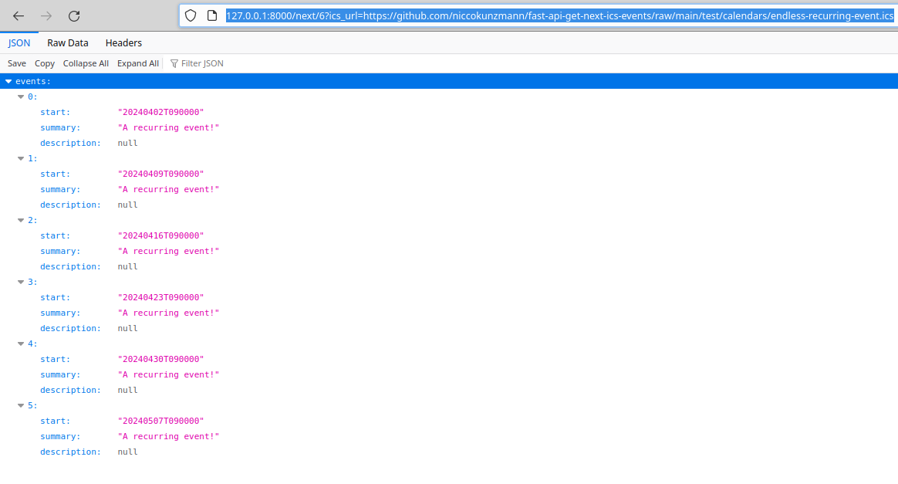

# fast-api-get-next-ics-events



[FastAPI](https://fastapi.tiangolo.com/) service to get the next few events from an ICS link as JSON


## Local Setup

1. Get the repository.

   ```sh
   git clone https://github.com/niccokunzmann/fast-api-get-next-ics-events
   cd fast-api-get-next-ics-events
   ```

2. Install Python 3.
3. Install the requirements.

   ```
   pip3 install -r requirements.txt
   ```

4. Run the server.

   ```sh
   uvicorn app:app --reload
   ```

5. Check out the events at  
   http://127.0.0.1:8000/next/6?ics_url=https://github.com/niccokunzmann/fast-api-get-next-ics-events/raw/main/test/calendars/endless-recurring-event.ics

## Testing

This describes the test setup after you have set up the Local Setup.

1. Install `tox`

   ```sh
   pip install tox
   ```
   
2. Run `tox`

   ```sh
   tox # run with all Python versions
   tox -e py310 # run Python 3.10 only
   ```
